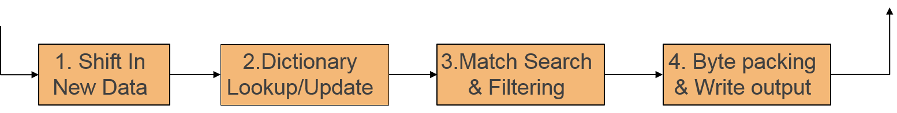
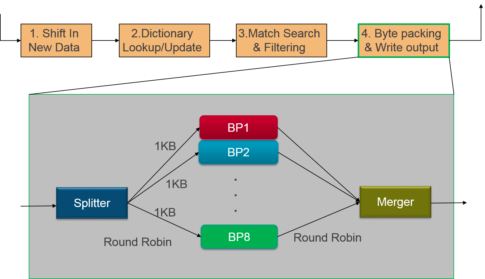

# GZip 

Gzip is a file format used for file compression and decompression. 

## Overview

Gzip is based on the DEFLATE algorithm. The complete GZip application has two parts:

1. LZ77 compression 
2. Huffman encoding

In this example GZip implementation, the LZ77 module has been accelerated on the
FPGA device available on the AWS F1 instance. The accelerated LZ77 algorithm
provides a throughput of 3.5GBytes/s using 2 compute units. Higher performance
can be achieved by using additional compute units. FPGA accelerated LZ77 module 
achieves 1.5x compression ratio.


### Resource Utilization

The LZ77 kernel runs at 250MHz and uses the following resources:

| Design | Compute Units | LUT | LUTMEM | REG | BRAM | DSP |
| ------ | ------------- | --- | ------ | --- | ---- | --- |
| 8 Bytes/clock | 1 | 31842(3.57%) | 1202(0.22%) |35577(1.79%) | 277(17.15%) |0|
| 8 Bytes/clock | 2 | 63669(7.18%) | 2404(0.44%) | 71154(3.60%) | 554(34.30%)|0|

## Algorithm Description

In this example, the Huffman encoding is still being run as part of the host
application and it is not yet accelerated. The LZ77 kernel is implemented as a C/C++
kernel and compiled using SDAccel.

The following picture shows various internal dataflow stages (pipeline stages)
into which the kernel implementation has been split:  
  
  

  <br />


  
Following are some of the key architectural decisions taken to achieve the
necessary performance:

1.  The whole LZ77 pipeline has been designed to process 8bytes/cycle. To
achieve this, we read 8byte in parallel from DDR memory, and then perform
multiple comparison in the dictionary to find the best match. Every cycle, we
compare multiple sub-strings in an 8-byte length to find the best match.
2.  To perform multiple comparisons every cycle, several copies of the
dictionary data is maintained. The dictionary is also updated every cycle to
avoid conditional writes.
3.  The last stage of LZ77 compression performs a byte-level packing of the
data. This step by definition has a throughput of 1Byte per cycle. Hence, to
match the throughput of earlier stages of 8Bytes/cycle, the incoming data stream
is split into 8 parallel stream of 1KB each and sent to separate pipelines. In
the end, streams from multiple pipes are written to DDR.  


 <br />
  
  
## Software & Hardware

```
  Software : Xilinx SDx 2017.1
  Hardware : xilinx:aws-vu9p-f1:4ddr-xpr-2pr (AWS VU9p DSA)
```
 
## Execution Steps

This example is provided with two popular compression benchmarks. 

1. [Silesia](http://sun.aei.polsl.pl/~sdeor/index.php?page=silesia)
2. [Canterybury](http://corpus.canterbury.ac.nz/descriptions/#cantrbry)

```
  Input Arguments: 
    
        1. To execute list/batch of files: -l <files.list> (files.list contains list of files)
        2. To execute single file: -i <file>
        
   Note: Default arguments are set in Makefile
```

### Emulation flows
```
  make check TARGETS=<sw_emu/hw_emu>
  
  Note: This command compiles for targeted emulation mode and executes the application
```
### Hardware

Command below compiles for hardware execution. It generates kernel binary ".xclbin" file. This file is placed in ./xclbin directory under GZip folder. To execute it on AWS F1 instance, please follow instructions specific to AWS F1 deployment process.

```
  make all TARGETS=hw 
```


  
  

