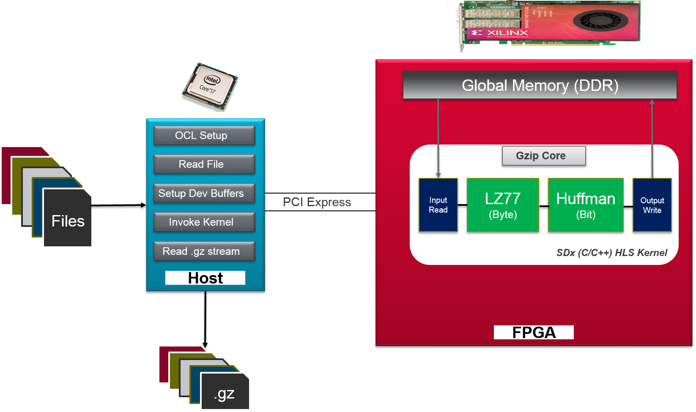
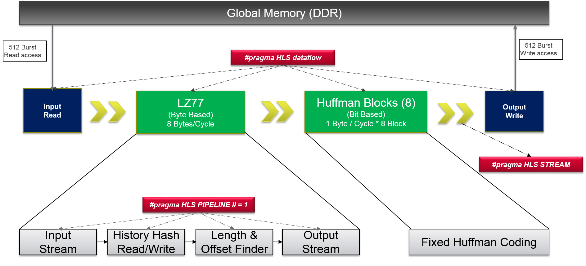
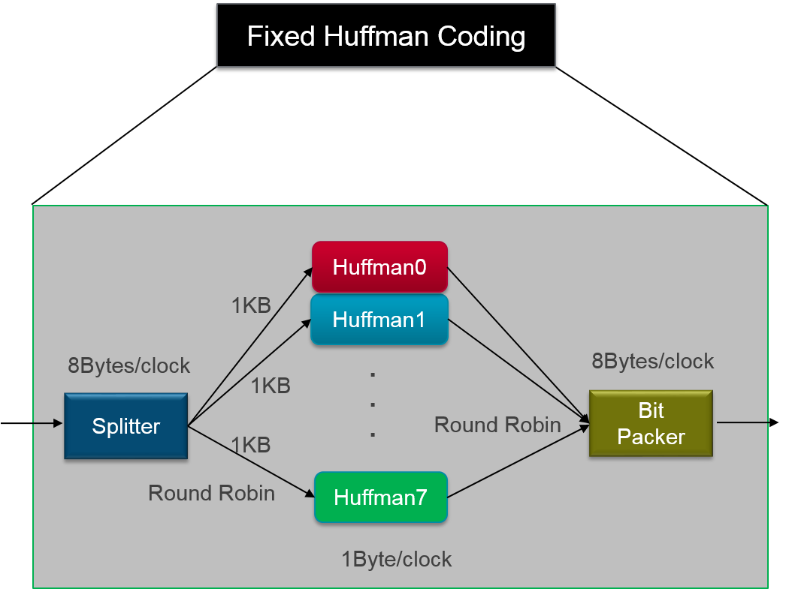

# GZip 

Gzip is a file format used for file compression and decompression. 

## Overview

Gzip is based on the DEFLATE algorithm. The complete GZip application has two parts:

1. LZ77 compression 
2. Huffman encoding

In this example GZip implementation, the LZ77 and Static Huffman modules are accelerated on the FPGA
device available on the AWS F1 instance. The accelerated GZip application provides a throughput of 1.6GB/s. This GZip example achieves around 1.7x compression ratio overall (Silesia Benchmark).

Note: This implementation of GZip doesnt include CRC32 logic, due to this while using standard gzip decoder with "-d" option results in crc related warning and decompression fails. To overcome this issue please use standard GZip decoder with following option always.


```
	gzip -dc compressedfile.gz > outputfilename
	
	Note: Execution of this command generates "crc" warning, this warning can be ignored.
```


### Resource Utilization

| Design (Bytes/Clock)  | LUT | LUTMEM | REG | BRAM | DSP | Fmax (MHz) |
| --------------- | --- | ------ | --- | ---- | --- | -----|
| 8               | 45183(5.07%) | 1325(0.24%) |46176(2.33%) | 299(18.51%) |0|250


## Algorithm Description

In this GZip example, LZ77 and Static Huffman compression algorithms are accelerated using FPGA device.
The GZip kernel is implemented as a C/C++ kernel using SDAccel flow. 

The following picture presents overview of accelerated GZip application. The encoded stream of this application
is compatible with standard GZip application. 

  <br />

The following picture shows various internal dataflow stages (pipeline stages)
into which the kernel implementation has been split:  
  
 
  <br />


  
Following are some of the key architectural decisions taken to achieve the
necessary performance:

1.  The whole GZip pipeline has been designed to process 8bytes/cycle. To
achieve this, we read 8byte in parallel from DDR memory, and then perform
multiple comparison in the dictionary to find the best match. Every cycle, we
compare multiple sub-strings in an 8-byte length to find the best match.
2.  To perform multiple comparisons every cycle, several copies of the
dictionary data is maintained. The dictionary is also updated every cycle to
avoid conditional writes.
3.  The last stage of GZip compression performs Static Huffman encoding which is a bit-level packing of the
data. This step by definition has a throughput of 1Byte per cycle. Hence, to
match the throughput of earlier stages of 8Bytes/cycle, the incoming data stream
is split into 8 parallel stream of 1KB each and sent to separate pipelines. In
the end, streams from multiple pipes are written to DDR.  


  <br />
  
## Software & Hardware

```
  Software: Xilinx SDx 2017.1
  Hardware: xilinx:aws-vu9p-f1:4ddr-xpr-2pr:4.0 (AWS VU9p F1 DSA)
```
 
## Execution Steps

This example is provided with two popular compression benchmarks. 

1. [Silesia](http://sun.aei.polsl.pl/~sdeor/index.php?page=silesia)
2. [Canterbury](http://corpus.canterbury.ac.nz/descriptions/#cantrbry)

```
  Input Arguments: 
    
        1. To execute batch of files: -l <files.list> -b <size of batch> 
        2. To execute single file: -i <file>
        
   Note: Default arguments are set in Makefile
```

### Emulation flows
```
  make check TARGETS=<sw_emu/hw_emu> DEVICES=$AWS_PLATFORM
  
  Note: This command compiles for targeted emulation mode and executes the
        application. To execute it on AWS F1 instance, please follow instructions
        specific to AWS F1 emulation.

```
### Hardware

```
  make all TARGETS=hw DEVICES=$AWS_PLATFORM

  Note: This command compiles for hardware execution. It generates kernel binary ".xclbin" file. 
        This file is placed in ./xclbin directory under GZip folder. To execute it on AWS F1 instance, 
        please follow instructions specific to AWS F1 deployment process.

```

### Expected Output

This section presents various steps involved to generate encode and decode output. The encoded stream of this example is compatible with standard GZip application present in Linux machines. The encoded stream can be decoded using standard GZip decoder, this application doesn't support decoder option.

```
1. Encode input file 
   a. LZ77 (FPGA) encode
   b. Huffman (FPGA) encode
2. Generate encoded file GZip standard (xil.gz) format
3. Decode (.gz) file generated in previous steps
   a. Use standard GZip decoder. For example: gzip -dc <xil.gz> > output.xil
4. Command in step 3, generates original file
5. Validate results (input file & standard GZip decode file) 
   a. PASSED: Status is passed it means both files matches
   b. FAILED: Status is failed it means there is mismatch
   c. Note: Validation is supported if "-l" option is used.
   d. Note: if "-i" is used then application generates ".xil.gz" encoded stream which can be decoded 
             using standard GZip decoder (Example: gzip -dc <filename.xil.gz> > output.xil)
```

#### Usage 

This section presents steps to use this application effectively. 


| Mode | Throughput (MB/s) | Module |
| -----| ------ |-------|
| Batch of Files| 1.54  | Host & Device|
| Single File   | 1.92	| Device |

Table above presents the best throughput achieved during execution of this application.
In batch mode this application performs overlapped execution between host and device.
In single file mode kernel (device) throughput is presented.

```
------------------------------------------------------------------------------------------------------------

Batch Mode Command: ./xil_gzip -l webster.list -b 0
                  
Note: If batch size is 0, all the files are attempted to process in batch mode.
      Throughput (MB/s) presented in batch mode execution corresponds to end to end execution
      (Host and Device).
      
------------------------------------------------------------------------------------------------------------

Single File Mode Command: ./xil_gzip -i benchmark/silesia/webster 

Note: In single file mode host to device overlapped execution is not possible.
      Throughput (KT(MBps)) presented in single file mode corresponds to kernel (Device) execution only.
      
-------------------------------------------------------------------------------------------------------------

```


