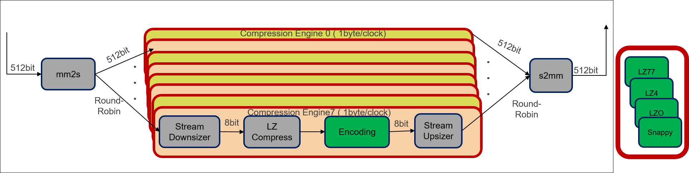

# Xilinx Snappy  

Xilinx Snappy compression/decompression is FPGA based implementation of standard Snappy. 
Xilinx implementation of Snappy application is aimed at achieving high throughput for both compression and decompression.
This Xilinx Snappy application is developed and tested on AWS F1 instance. To know
more about standard Snappy application please refer https://github.com/snappy/snappy

This application is accelerated using generic hardware architecture for LZ based data compression algorithms.

 <br />

 <br />

For more details refer this [link](https://gitenterprise.xilinx.com/heeran/xil_snappy/blob/master/README.md)


## Results

### Resource Utilization <br />

Table below presents resource utilization of Xilinx Snappy compress/decompress
kernels with 8 engines for single compute unit. It is possible to extend number of engines to achieve higher throughput.


| Design | LUT | LUTMEM | REG | BRAM | URAM| DSP | Fmax (MHz) |
| --------------- | --- | ------ | --- | ---- | --- | -----| -----|
| Compression on F1      | 72372(7.35%) | 16589(2.92%)|71489(3.46%)|146(7.68%) | 48(5.23%)|1(0.01%)|258.3|
| Compression on U200     | 54124(5.35%) | 14303(2.50%)|66429(3.12%)|146(8.04%) | 48(5.00%)|1(0.01%)|273.2|
| Decompression on F1 | 36284 (3.63%) | 13774 (2.40%) | 43462 (2.06%) | 146 (7.6%) | 0 | 1 (0.01%) | 
| DeCompression on U200   | 35651(3.45%) | 13762(2.40%)|40924(1.90%)|146(7.93%) | 0|1(0.01%)|300|


### Throughput & Compression Ratio

Table below presents the best kernel throughput achieved with single compute unit during execution of this application.

| Topic| Results| 
|-------|--------|
|Best Compression Throughput|1.63 GB/s|
|Best Decompression Throughput|1.72 GB/s|
|Average Compression Ratio| 2.13x (Silesia Benchmark)|

Note: Overall throughput can still be increased with multiple compute units.

## Software & Hardware

```
  Software: Xilinx SDx 2018.2
  Hardware: xilinx_aws-vu9p-f1-04261818_dynamic_5_0 (AWS VU9p F1 DSA)

  Software: Xilinx SDx 2018.3
  Hardware: xilinx_u200_xdma_201830_1 (Xilinx Alveo U200)
```
 
## Usage


### Build Steps

#### Emulation flows
```
  make check TARGETS=<sw_emu/hw_emu> DEVICES=$AWS_PLATFORM
  
  Note: This command compiles for targeted emulation mode and executes the
        application. To execute it on AWS F1 instance, please follow instructions
        specific to AWS F1 emulation.
```
#### Hardware

```
  make all TARGETS=hw DEVICES=$AWS_PLATFORM

  Note: This command compiles for hardware execution. It generates kernel binary ".xclbin" file. 
        This file is placed in ./xclbin directory under Snappy folder. To execute it on AWS F1 instance, 
        please follow instructions specific to AWS F1 deployment process.

```

### Execution Steps

While using PARALLEL_BLOCK (8 default) the generated executable would be
"xil_snappy_8b"

```
  Input Arguments: 
    
        1. To execute single file for compression :  ./xil_snappy_8b -c <file_name>
        2. To execute single file for decompression: ./xil_snappy_8b -d <file_name.snappy>
        3. To validate various files together:       ./xil_snappy_8b -l <files.list>
            3.a. <files.list>: Contains various file names with current path    
        
   Note: Default arguments are set in Makefile

  Help:

        ===============================================================================================
        Usage: application.exe -[-h-c-l-d-B-x]

                --help,         -h      Print Help Options   Default: [false]
                --compress,     -c      Compress
                --file_list,    -l      List of Input Files
                --decompress,   -d      Decompress
                --block_size,   -B      Compress Block Size [0-64: 1-256: 2-1024: 3-4096] Default: [0]
                --flow,     -x      Validation [0-All: 1-XcXd: 2-XcSd: 3-ScXd]   Default:[1]
        ===============================================================================================

```


### Limitations

#### Decompression

- Single block per chunk is supported at present


